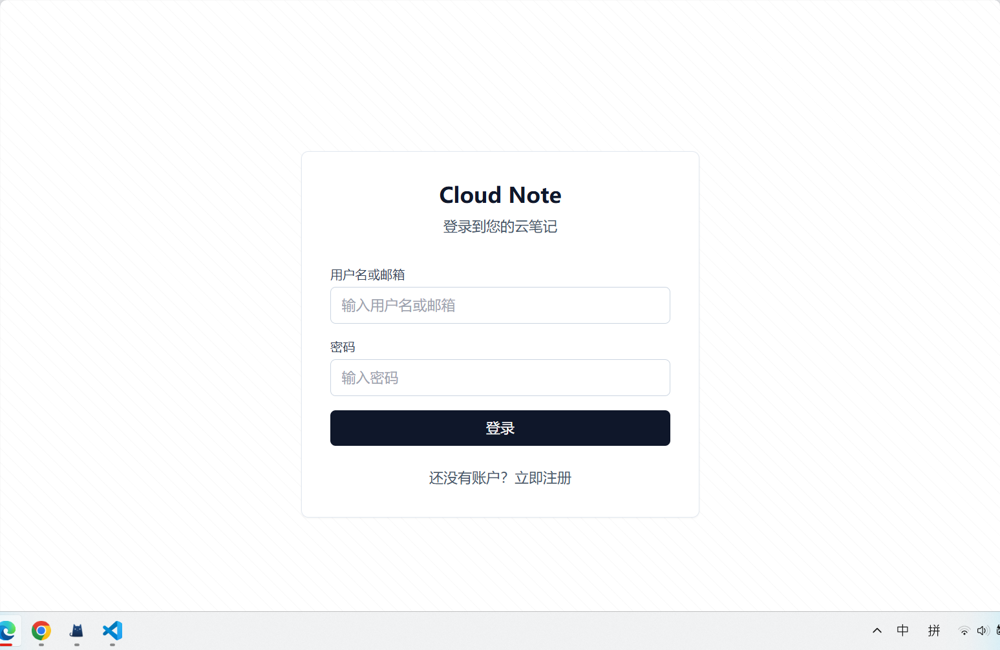
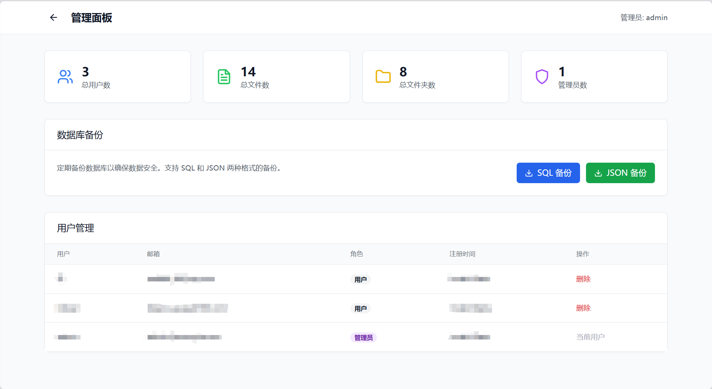
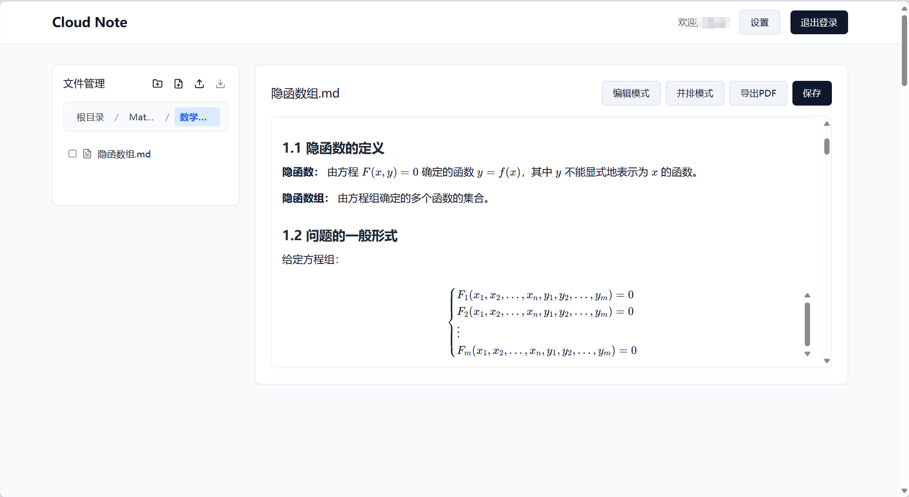
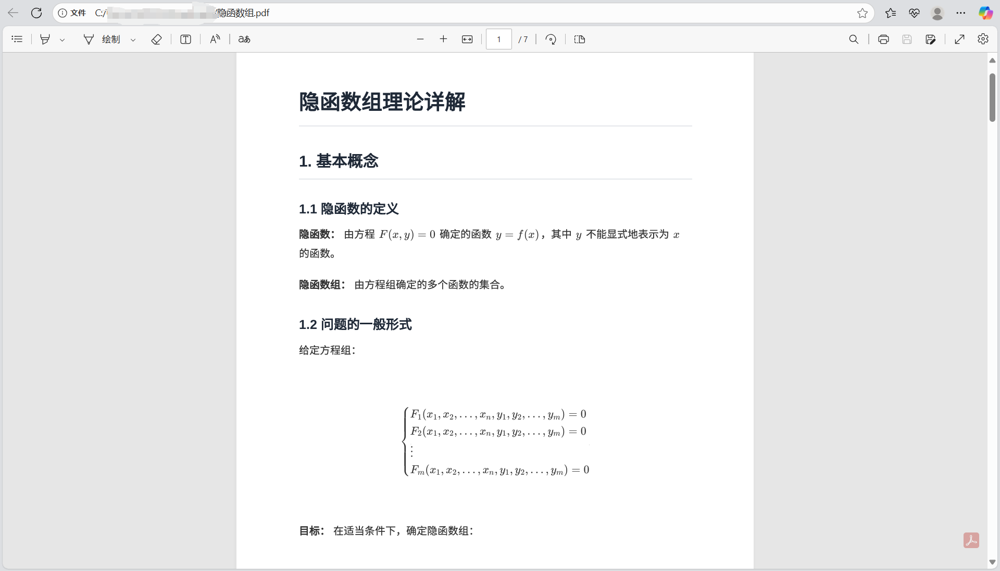

# Cloud Note - 云笔记

一个Web端云笔记应用，支持Markdown编辑、LaTeX数学公式、文件管理等功能。

啰里啰唆写在正文之前：这是一个Claudecode写的项目，可能代码漏洞很多，部署有困难之类的，且本人代码基础很差，无法进行长期的维护，如果有感兴趣的开发者可以联系我，邮箱:dream_essay@outlook.com

想做这个项目的原因：个人非常喜欢Obsidian笔记软件，特别是其对数学公式的预览，以及导出PDF的功能(尽管移动端这个功能还未上限)，但由于无法即时地跨平台同步笔记，这个问题困扰了自己很久(现在已解决),又尝试过Github上优秀的网页笔记项目，例如Memos和Blossom，可是总归有些缺欠的地方，前者更适合作为一个"随时记"的便签项目，很可爱，可是由于没有目录和子目录，总归有些查阅不便，后者Blossom无法渲染矩阵之类复杂的Latex，于是也放弃。由于AI编程的兴起，于是凭借对网页开发不多的知识做了这个项目，尝试复现Obsidian的一些功能，尽管来说是比较拙劣的模仿


### 核心功能
- 🔐 **用户系统**：用户注册/登录，支持管理员权限管理
- 📝 **Markdown编辑器**：支持LaTeX数学公式渲染和代码高亮
- 📁 **文件管理**：完整的文件夹和文件管理系统
- 👀 **实时预览**：Markdown编辑和预览模式切换

### 演示示例

#### 登录页面

#### 管理后台

#### Markdown预览

#### PDF导出



## 本地开发环境配置

### 1. 安装依赖

```bash
# 安装根目录依赖
npm run install:all

# 或者分别安装
npm install
cd frontend && npm install
cd ../backend && npm install
```

### 2. 启动开发服务器

```bash
# 同时启动前端和后端开发服务器
npm run dev

# 或者分别启动
npm run dev:frontend  # 前端开发服务器 (端口3000)
npm run dev:backend   # 后端开发服务器 (端口3001)
```

### 3. 访问应用

- 前端地址: http://localhost:3000
- 后端API: http://localhost:3001/api

### 4. 默认管理员账户

- 用户名: `admin`
- 密码: `password`

## 生产环境部署

### 1. 环境要求

- Ubuntu 服务器
- Node.js 18+
- MySQL 8.0+
- Nginx
- PM2 (推荐用于进程管理)

### 2. 服务器部署步骤

#### 2.1 克隆项目到服务器

```bash
cd /root
git clone <your-repo-url> cloud-note
cd cloud-note
```

#### 2.2 安装依赖

```bash
# 安装Node.js (如果还没安装)
curl -fsSL https://deb.nodesource.com/setup_18.x | sudo -E bash -
sudo apt-get install -y nodejs

# 安装项目依赖
npm run install:all

# 安装 Chrome 和 PDF 导出依赖 (重要！)
chmod +x install-chrome.sh
./install-chrome.sh
```

#### 2.3 构建前端

```bash
npm run build
```

#### 2.4 安装和配置 MySQL

```bash
# 安装 MySQL
sudo apt update
sudo apt install mysql-server

# 启动 MySQL 服务
sudo systemctl start mysql
sudo systemctl enable mysql

# 安全配置 MySQL
sudo mysql_secure_installation

# 创建数据库和用户
sudo mysql -u root -p
```

在 MySQL 控制台中执行：

```sql
CREATE DATABASE cloudnote CHARACTER SET utf8mb4 COLLATE utf8mb4_unicode_ci;
CREATE USER 'cloudnote'@'localhost' IDENTIFIED BY 'secure_password_here';
GRANT ALL PRIVILEGES ON cloudnote.* TO 'cloudnote'@'localhost';
FLUSH PRIVILEGES;
EXIT;
```

#### 2.5 配置环境变量

创建后端环境配置文件:

```bash
cd backend
touch .env
```

编辑 `.env` 文件:

```bash
# 数据库配置
DB_HOST=localhost
DB_PORT=3306
DB_USER=cloudnote
DB_PASSWORD=secure_password_here
DB_NAME=cloudnote

# 服务器配置
PORT=3001
JWT_SECRET=your-super-secret-jwt-key-here
NODE_ENV=production
```

#### 2.6 初始化数据库

```bash
# 初始化数据库结构
node scripts/init-db.js

# 如果从 JSON 数据库迁移
node scripts/migrate-to-mysql.js
```

#### 2.7 安装PM2并启动后端服务

```bash
# 安装PM2
npm install -g pm2

# 启动后端服务
cd /root/cloud-note/backend
pm2 start index.js --name "cloud-note-backend"

# 设置PM2开机自启
pm2 startup
pm2 save
```

#### 2.8 配置Nginx

```bash
# 复制nginx配置文件
sudo cp /root/cloud-note/cloud-note.conf /etc/nginx/sites-available/

# 创建软链接启用站点
sudo ln -s /etc/nginx/sites-available/cloud-note.conf /etc/nginx/sites-enabled/

# 测试nginx配置
sudo nginx -t

# 重载nginx配置
sudo systemctl reload nginx
```

#### 2.9 配置SSL证书 (推荐)

使用Let's Encrypt免费SSL证书:

```bash
# 安装certbot
sudo apt install certbot python3-certbot-nginx

# 获取SSL证书
sudo certbot --nginx -d note.dream-essay.cn

# 设置自动续期
sudo crontab -e
# 添加以下行:
# 0 12 * * * /usr/bin/certbot renew --quiet
```

#### 2.10 设置防火墙

```bash
# 开放必要端口
sudo ufw allow 22    # SSH
sudo ufw allow 80    # HTTP
sudo ufw allow 443   # HTTPS
sudo ufw enable
```

### 3. 部署验证

1. 访问 https://note.dream-essay.cn 检查网站是否正常运行
2. 测试用户注册/登录功能
3. 测试文件创建、编辑、保存功能
4. 测试文件上传/下载功能
5. 检查管理员面板是否正常

### 4. 维护命令

```bash
# 查看后端服务状态
pm2 status

# 查看日志
pm2 logs cloud-note-backend

# 重启后端服务
pm2 restart cloud-note-backend

# 查看nginx日志
sudo tail -f /var/log/nginx/cloud-note.access.log
sudo tail -f /var/log/nginx/cloud-note.error.log

# 重新部署
cd /root/cloud-note
git pull
npm run build
pm2 restart cloud-note-backend
```

### 5. PDF导出故障排除

如果PDF导出功能不工作，请按以下步骤排查：

#### 5.1 检查Chrome安装
```bash
# 检查Chrome是否已安装
which google-chrome-stable
which chromium-browser
which chromium

# 测试Chrome是否可以运行
google-chrome-stable --version --no-sandbox
```

#### 5.2 检查依赖
```bash
# 如果Chrome未安装，运行安装脚本
./install-chrome.sh

# 手动安装Chrome (替代方案)
wget -q -O - https://dl.google.com/linux/linux_signing_key.pub | sudo apt-key add -
echo "deb [arch=amd64] http://dl.google.com/linux/chrome/deb/ stable main" | sudo tee /etc/apt/sources.list.d/google-chrome.list
sudo apt-get update
sudo apt-get install -y google-chrome-stable
```

#### 5.3 检查系统资源
```bash
# 检查内存使用情况 (PDF生成需要足够内存)
free -h

# 检查磁盘空间
df -h
```

#### 5.4 环境变量配置
```bash
# 在 backend/.env 中添加以下配置
echo "PUPPETEER_EXECUTABLE_PATH=/usr/bin/google-chrome-stable" >> backend/.env
echo "NODE_ENV=production" >> backend/.env

# 重启服务
pm2 restart cloud-note-backend
```

## 项目结构

```
cloud-note/
├── frontend/                 # Vue.js前端
│   ├── src/
│   │   ├── components/      # 可复用组件
│   │   ├── views/          # 路由页面
│   │   ├── stores/         # Pinia状态管理
│   │   ├── utils/          # 工具函数
│   │   └── router/         # 路由配置
│   ├── dist/               # 构建输出目录
│   └── package.json
├── backend/                  # Node.js后端
│   ├── routes/             # API路由
│   ├── middleware/         # 中间件
│   ├── utils/              # 工具函数
│   ├── data/               # 数据存储
│   ├── uploads/            # 上传文件存储
│   └── package.json
├── cloud-note.conf          # Nginx配置文件
└── README.md
```

## 开发说明

### API接口

#### 认证相关
- `POST /api/auth/register` - 用户注册
- `POST /api/auth/login` - 用户登录
- `GET /api/auth/me` - 获取当前用户信息

#### 文件管理
- `GET /api/files/tree` - 获取文件树
- `POST /api/files/folder` - 创建文件夹
- `POST /api/files/file` - 创建/更新文件
- `GET /api/files/file/:id` - 获取文件内容
- `DELETE /api/files/file/:id` - 删除文件
- `DELETE /api/files/folder/:id` - 删除文件夹
- `PUT /api/files/file/:id/rename` - 重命名文件
- `PUT /api/files/folder/:id/rename` - 重命名文件夹
- `PUT /api/files/file/:id/move` - 移动文件
- `PUT /api/files/folder/:id/move` - 移动文件夹
- `POST /api/files/upload` - 上传文件
- `GET /api/files/download/:id` - 下载文件

#### 管理员功能
- `GET /api/admin/users` - 获取用户列表
- `GET /api/admin/stats` - 获取系统统计
- `DELETE /api/admin/users/:id` - 删除用户

### 数据存储

项目使用 MySQL 数据库进行数据存储，支持更可靠的数据管理和备份。

### MySQL 配置

#### 1. 安装和配置 MySQL

确保您的系统已安装 MySQL 8.0+ 并且服务正在运行：

```bash
# Ubuntu/Debian
sudo apt install mysql-server

# macOS
brew install mysql

# Windows
# 从 https://dev.mysql.com/downloads/mysql/ 下载安装包
```

#### 2. 配置数据库连接

在 `backend/.env` 文件中配置数据库连接信息：

```bash
# 数据库配置
DB_HOST=localhost
DB_PORT=3306
DB_USER=root
DB_PASSWORD=your_mysql_password
DB_NAME=cloudnote

# JWT 密钥
JWT_SECRET=your-super-secret-jwt-key-here

# 服务器端口
PORT=3001
```

#### 3. 初始化数据库

首次运行时，执行数据库初始化脚本：

```bash
cd backend
node scripts/init-db.js
```

#### 4. 数据迁移（从 JSON 升级）

如果您之前使用 JSON 数据库，可以运行迁移脚本：

```bash
cd backend
node scripts/migrate-to-mysql.js
```

#### 5. 数据库备份

管理员可以通过管理面板下载数据库备份：
- **SQL 格式备份**：完整的 mysqldump 备份文件
- **JSON 格式备份**：便于查看的 JSON 格式数据导出

或通过 API 直接下载：
- `GET /api/admin/backup` - SQL 格式备份
- `GET /api/admin/backup-json` - JSON 格式备份

### 文件上传

上传的文件存储在 `backend/uploads/` 目录下

## 使用说明

### 基本操作

1. **文件管理**
   - 点击 `+` 按钮创建新文件夹或文件
   - 点击文件夹进入子目录
   - 使用面包屑导航快速返回上级目录

2. **文件编辑**
   - 双击文件打开编辑器
   - 支持Markdown语法和LaTeX数学公式
   - 使用 `Ctrl+S` 快速保存
   - 点击"预览"按钮查看渲染效果

3. **高级操作**
   - **拖拽移动**：直接拖拽文件/文件夹到目标位置
   - **右键菜单**：右键点击获取更多操作选项
   - **重命名**：右键选择重命名或点击编辑按钮
   - **文件上传**：点击上传按钮选择本地文件

## 许可证

MIT License

## 贡献

欢迎提交Issue和Pull Request！